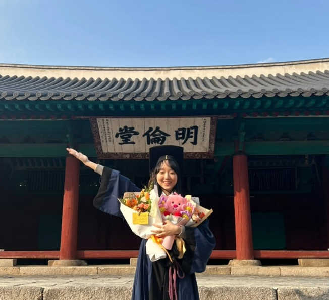

# About Me

My name is Yeeun Shin — you can just call me Yeeun (it's pronounced "Yeh-oon").

I am a graduate student at Seoul National University ([SNU](https://en.snu.ac.kr/)), advised by Prof. [Kyogu Lee](https://marg.snu.ac.kr/63b16fe3-365b-4a56-b970-1b3ec2839470). I received a B.S. degree in Applied Artificial Intelligence at Sungkyunkwan University. I am currently interested in Music AI and Human-Computer Interaction (HCI). My research goal is to enrich how people enjoy and connect with music by merging the emotional depth of music and the possibilities of AI.

 
 

# Publications
"Non-contact Input Method based on Face Recognition and Pyautogui Mouse Control" Sungjin Park, Yeeun Shin, Byungjun Lee, Hayoung Oh.<em> Journal of the Korea Institute of Information and Communication Engineering 2022.
</em>
 
 

# Education
##### Seoul National University (Sep 2025 - Aug 2027)
M.S. in Interdisciplinary Major in AI
##### Sungkyunkwan University (Mar 2021 - Feb 2025)
B.S. in Applied Artificial Intelligence
 
 

# Work Experience
##### Undergraduate Research Assistant (Dec 2023 - Dec 2024)
DSAIL@SKKU
- Extracted scripts from videos by integrating speech recognition and video captioning models.
- Developed and deployed REST APIs using FastAPI in an AWS development environment as a Python backend engineer.
 

##### AI Security Research Intern (July 2024 - Aug 2024)
Samsung Research
- Devised mitigation methods to resist any LLM jailbreak through prompt engineering and fine-tuning.
- ASR(Attack Success Rate) of only 2% was achieved through LLM fine-tuning in attack cases requiring personal information leakage.
 

##### AI Research & Development Intern (Sep 2023 - Dec 2023)
Visang Education
- Improved Knowledge Tracing Model Performance by using Transformer.
- Implemented a model demo web page with Flask

 
 

# Contact
E-mail📧 : yeeun.shin [AT] snu.ac.kr / random.seed042 [AT] gmail.com